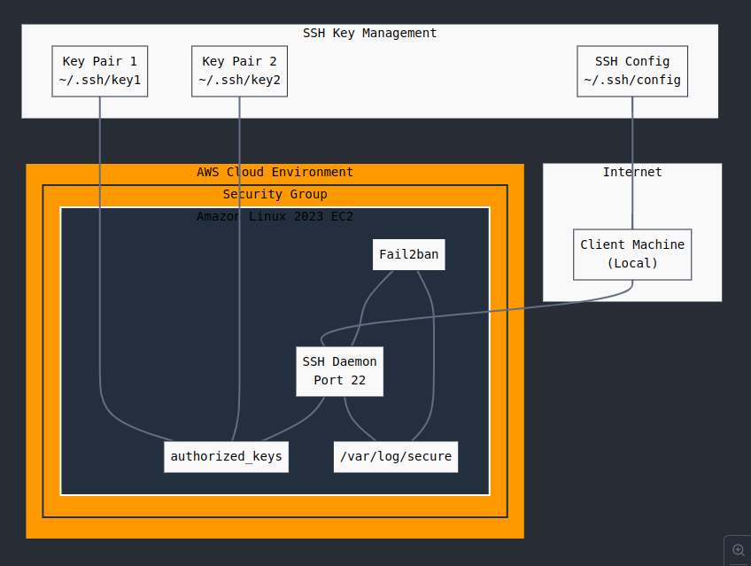
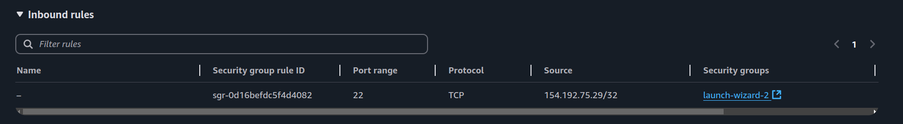
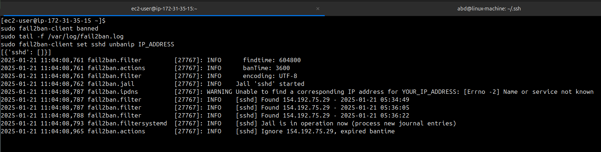

# Remote Linux Server SSH Configuration Project

> A comprehensive guide to setting up secure SSH access on an AWS EC2 instance with multiple key pairs and fail2ban protection.

---

## Table of Contents
- [Overview](#overview)
- [Prerequisites](#prerequisites)
- [Setup](#setup)
  - [EC2 Instance Creation](#ec2-instance-creation)
  - [Initial Connection](#initial-connection)
- [SSH Key Configuration](#ssh-key-configuration)
  - [Creating SSH Keys Locally](#creating-ssh-keys-locally)
  - [Server Key Configuration](#server-key-configuration)
- [Advanced Configuration](#advanced-configuration)
  - [SSH Config Setup](#ssh-config-setup)
  - [Fail2ban Installation](#fail2ban-installation)
- [Issues and Solutions](#issues-and-solutions)
- [Security Recommendations](#security-recommendations)
- [Files and Permissions Reference](#files-and-permissions-reference)
- [References](#references)

---

## Overview

This project demonstrates the setup of a secure SSH connection to a remote Linux server (AWS EC2) using multiple SSH keys and implementing brute force protection using fail2ban.

### Objectives Achieved
- [x] Set up an AWS EC2 instance
- [x] Created and configured multiple SSH keys
- [x] Established secure SSH connections
- [x] Implemented fail2ban protection
- [x] Configured SSH aliases



---

## Prerequisites

### Required Tools
- AWS Account
- Terminal access

- Basic understanding of Linux commands
- Text editor (nano/vim)

### AWS EC2 Setup Requirements
- Amazon Linux 2023
- t2.micro instance (free tier eligible)
- Security group with SSH access (Port 22)



---

## Setup

### EC2 Instance Creation
1. Log in to your AWS Management Console.
2. Navigate to the EC2 dashboard and launch an instance.
   - **AMI**: Amazon Linux 2023
   - **Instance Type**: t2.micro
   - **Security Group**: Allow SSH (Port 22)
3. Download the provided key pair and save it securely.


### Initial Connection
Use the AWS-provided private key to establish an initial connection:
```bash
chmod 400 initial-key.pem
ssh -i initial-key.pem ec2-user@<instance-ip>
```
# SSH Key Configuration

## Creating SSH Keys Locally

Generate two SSH key pairs locally:

```bash
# First key pair
ssh-keygen -t rsa -b 2048 -f ~/.ssh/key1

# Second key pair
ssh-keygen -t rsa -b 2048 -f ~/.ssh/key2
```

Server Key Configuration

1. Connect to your EC2 instance using the initial key.

2. Configure the .ssh directory and authorized_keys file:

``` bash
mkdir -p ~/.ssh
chmod 700 ~/.ssh
touch ~/.ssh/authorized_keys
chmod 600 ~/.ssh/authorized_keys
```

3. Copy the public keys (key1 and key2) into the authorized_keys file:

```bash
cat key1 >> ~/.ssh/authorized_keys
cat key2 >> ~/.ssh/authorized_keys
```

## Advanced Configuration
### SSH Config Setup
Simplify connections using the SSH configuration file:

```bash
# ~/.ssh/config
Host ec2-server
    HostName <instance-ip>
    User ec2-user
    IdentityFile ~/.ssh/key1
```
Now, connect to your instance using:
```bash
ssh ec2-server
```

### Fail2ban Installation
Install and configure fail2ban to protect against brute force attacks:

```bash
sudo dnf install fail2ban -y
sudo systemctl start fail2ban
sudo systemctl enable fail2ban
```

### Fail2ban Configuration
Edit the jail.local file to enable protection:

```bash
[DEFAULT]
# Ban for 1 hour (3600 seconds)
bantime = 3600

# Check for repeat offenders over 1 week (604800 seconds)
findtime = 604800

# Ban after 3 failed attempts
maxretry = 3

# Ignore our own IP addresses (replace with your IP)
ignoreip = 127.0.0.1/8 YOUR_IP_ADDRESS

[sshd]
enabled = true
port = ssh
filter = sshd
logpath = /var/log/secure
maxretry = 3
```

Restart the service to apply changes:

```bash
sudo systemctl restart fail2ban
```

