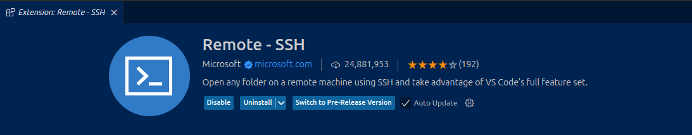
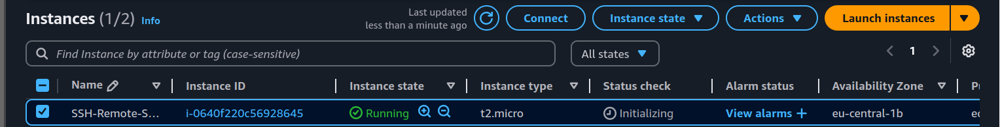
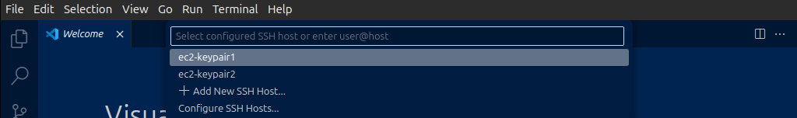

# Setting Up EC2 Instance with Multiple SSH Key Pairs and VS Code Remote Connection

This guide provides step-by-step instructions to launch an EC2 instance, configure multiple SSH key pairs, and connect to the instance using Visual Studio Code's Remote - SSH extension.

## Prerequisites

- **AWS Account**: Ensure you have an active AWS account.
- **Visual Studio Code**: Install [VS Code](https://code.visualstudio.com/).
- **Remote - SSH Extension**: Install the [Remote - SSH](https://marketplace.visualstudio.com/items?itemName=ms-vscode-remote.remote-ssh) extension in VS Code.
- 

## 1. Launch an EC2 Instance

1. **Access AWS Management Console**: Log in to your AWS account and navigate to the EC2 dashboard.
2. **Launch Instance**:
   - Click on "Launch Instance."
   - Choose an Amazon Machine Image (AMI) and instance type.
   - In the "Configure Instance" step, proceed without selecting a key pair for now.
3. **Configure Security Group**:
   - Ensure the security group allows inbound SSH (port 22) from your IP address.
   - 
4. **Launch Instance**: Complete the launch process.
    - 

## 2. Create and Add Multiple SSH Key Pairs

1. **Generate New SSH Key Pairs**:
   - On your local machine, generate two new SSH key pairs:
     ```bash
     ssh-keygen -t rsa -b 2048 -f ~/.ssh/keypair1 -C "KeyPair1"
     ssh-keygen -t rsa -b 2048 -f ~/.ssh/keypair2 -C "KeyPair2"
     ```
   - This creates `keypair1`, `keypair1.pub`, `keypair2`, and `keypair2.pub` in the `~/.ssh/` directory.
2. **Retrieve Public Keys**:
   - Display the contents of the public keys:
     ```bash
     cat ~/.ssh/keypair1.pub
     cat ~/.ssh/keypair2.pub
     ```
3. **Connect to EC2 Instance**:
   - Use the existing PEM key to SSH into your EC2 instance:
     ```bash
     ssh -i "existing-key.pem" ec2-user@<your-ec2-public-ip>
     ```
4. **Add Public Keys to `authorized_keys`**:
   - On the EC2 instance, navigate to the `.ssh` directory:
     ```bash
     cd ~/.ssh
     ```
   - Append the contents of `keypair1.pub` and `keypair2.pub` to the `authorized_keys` file:
     ```bash
     cat /path/to/keypair1.pub >> authorized_keys
     cat /path/to/keypair2.pub >> authorized_keys
     ```
   - Ensure the `authorized_keys` file has the correct permissions:
     ```bash
     chmod 600 authorized_keys
     ```

## 3. Set Up VS Code for Remote SSH Access

1. **Install Remote - SSH Extension**:
   - In VS Code, go to the Extensions view (`Ctrl+Shift+X`) and install the "Remote - SSH" extension.
2. **Configure SSH Settings**:
   - Press `F1`, type "Remote-SSH: Open Configuration File," and select it.
   - Add entries for both key pairs:
     ```plaintext
     Host ec2-keypair1
         HostName <your-ec2-public-ip>
         User ec2-user
         IdentityFile ~/.ssh/keypair1

     Host ec2-keypair2
         HostName <your-ec2-public-ip>
         User ec2-user
         IdentityFile ~/.ssh/keypair2
     ```
3. **Connect Using VS Code**:
   - Press `F1`, type "Remote-SSH: Connect to Host," and select either `ec2-keypair1` or `ec2-keypair2`.
   - VS Code will establish an SSH connection to your EC2 instance using the selected key pair.
   - 

## 4. Verify the Connection

- Once connected, you can open a terminal within VS Code and run commands on your EC2 instance.
- You can also open folders and files on the EC2 instance directly in VS Code.
- 

**Note**: Ensure that the security group associated with your EC2 instance allows inbound SSH connections from your local machine's IP address.

For a visual walkthrough, you might find the following video helpful:

[Connect EC2 With VSCode SSH](https://www.youtube.com/watch?v=KQr0eI97cLQ)


For more challanges like I did you can visit roadmap:

[Build a ssh-remote-server-setup](https://roadmap.sh/projects/ssh-remote-server-setup)
